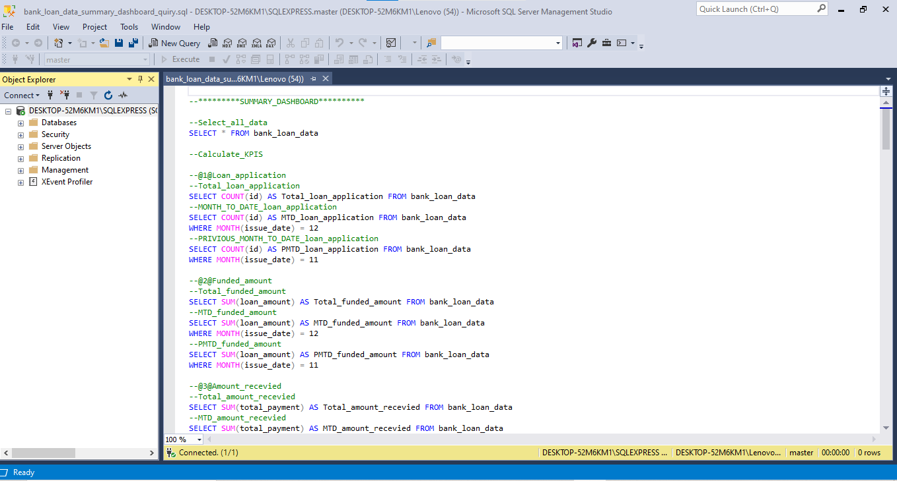
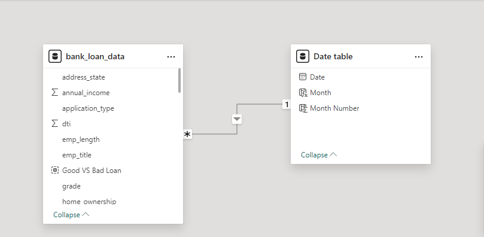
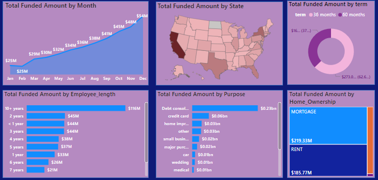
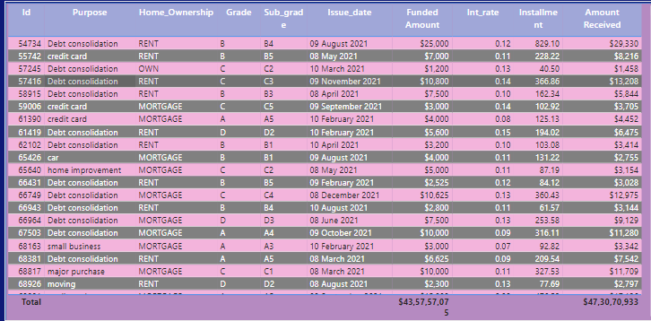
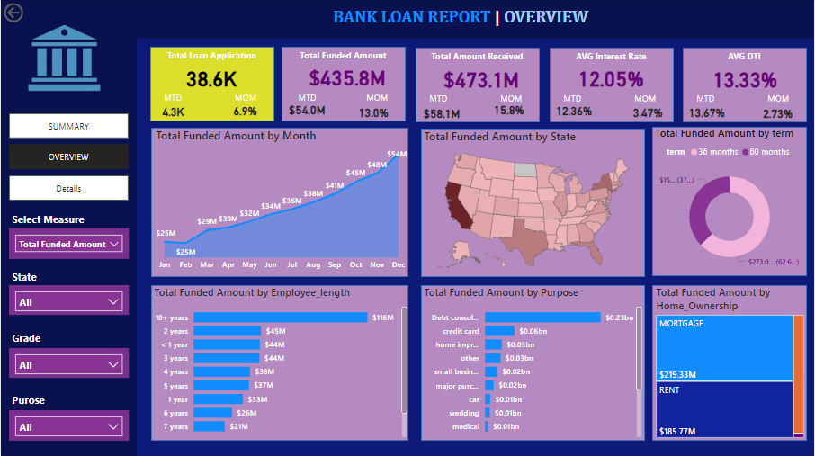
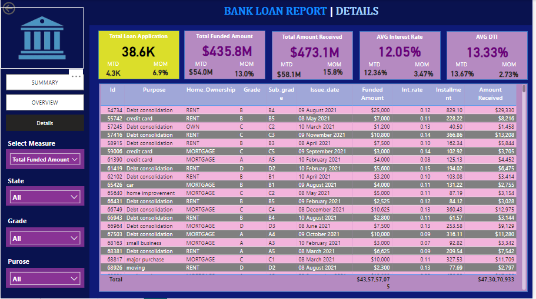

# BANK_LOAN_DATASET_ANALYSIS

## INTRODUCTION

Welcome to the Bank Loan Analysis Project.
This project leverages the powerful capabilities of Excel, SQL, and Microsoft Power BI focuses on harnessing the capabilities of these tools to analyze, visualize, and interpret loan data. Aims to evaluate and predict the risk associated with loan applications. This analysis helps banks and financial institutions make informed decisions about approving or rejecting loan requests.

## PROBLEM STATEMENT

In order to monitor and assess our bank's lending activities and performance, we need to create a comprehensive Bank Loan Report. This report aims to provide insights into key loan-related metrics and their changes over time. The report will help us make data-driven decisions, track our loan portfolio's health, and identify trends that can inform our lending strategies.

## TOOLS USED

- <u> EXCEL </u>  
Used Excel to convert unstructured data into a tabular format and created additional fields for deeper analysis.
- <u> SQL  </u>  
Used SQL to calculate KPIs and other metrics.
- <u> POWER BI  </u>  
Used Power BI to design interactive reports and analyze data to provide insights to stakeholders.

## DATA SOURCE

This is dami data.  
Format of dataset file is csv file cantain 38,576 rows and 25 colums

## DESIGNING & ANALYSIS 

### STEP 1

First we study the data properly by give a sufficient time on it.

### STEP 2

Than we do all the calculation in SQL 

#### Calculate Key Performance Indicators (KPIs):

- <u> Total Loan Application </u>  
- <u> Total Funded Amount  </u>  
- <u> Total Amount Received </u>  
- <u> Average Intrest Rate </u>  
- <u> Average Debt-to-Income Ratio (DTI) </u>  

### STEP 3

Than used data MODELING 

### STEP 4

Than we visualiza a data by using different chart and we play around it to get some insight from it.

#### Visualize Data Through Various Charts:

- <u> Line chart </u> = Monthly Trend by issue data  
- <u> Filled Map </u> = Regional Analysis by State   
- <u> Donut Chart  </u> = Loan Term Analysis   
- <u> Bar Chart </u> = Employee Length Analysis   
- <u> Bar chart </u> = Loan Purpose Breakdown  
- <u> Tree Map </u> = Home Ownership Analysis   

This above 2 steps for home tab dashboard & Now we design overview dashboard which is second dashboard.

### STEP 5

#### We crate dashboard 3 which give a detail of customers in grid view

GRID:
Need for a comprehensive 'Details Dashboard' that provides a consolidated view of all the essential information within our loan data. 
This Details Dashboard aims to offer a holistic snapshot of key loan-related metrics and data points, enabling users to access critical information efficiently.

Objective:
The primary objective of the Details Dashboard is to provide a comprehensive and user-friendly interface for accessing vital loan data. It will serve as a one-stop solution for users seeking detailed insights into our loan portfolio, borrower profiles, and loan performance.

#### By analyzing these KPIs and visualizations, we aim to provide actionable insights that will help optimize business operations, enhance customer satisfaction, and drive sales growth. The insights gained will support data-driven decision-making and strategic planning for the pizza chain.

 
 

|          SUMMARY DASHBOARD                | 
:---------------------------------------:|
    

 
|          OVERVIEW DASHBOARD               |
:-------------------------------------------:
 
 

|          DETAILS DASHBOARD             | 
:---------------------------------------:|
    

  
   

## CONCLUTION

The analysis of the bank loan data reveals the following key insights:

- <u> Total Loan Applications  </u> : 38,600
- <u> Good Loans Issued  </u> : 86.2%
- <u> Bad Loans Issued  </u> : 13.8%
- <u> Total Funded Amount  </u> : $435.8 million
- <u> Total Amount Received  </u> : $473.1 million
- <u> Average Interest Rate  </u> : 12.05%
- <u> Average Debt-to-Income (DTI) Ratio  </u> : 13.33%

#### The bank has issued a significant number of loans, with the majority being good loans (86.2%), indicating effective risk assessment and lending practices. The total amount funded ($435.8 million) compared to the total amount received ($473.1 million) shows a positive return, highlighting the profitability of the loan portfolio. The average interest rate of 12.05% and an average DTI ratio of 13.33% suggest that the bank is maintaining a balanced approach in lending, ensuring borrowers can manage their debt.

## Recommendations:

### 1.Enhance Risk Assessment:
- <u> Focus on Reducing Bad Loans  </u> :
Although the percentage of bad loans is relatively low, further reducing it can improve profitability and minimize potential losses. Implementing more stringent credit evaluation criteria and utilizing advanced predictive analytics can help achieve this.
- <u> Monitor High-Risk Segments  </u> :
Regularly review and analyze segments with higher default rates to understand underlying causes and adjust lending policies accordingly.

### 2.Optimize Interest Rates:
Competitive Interest Rates : Continuously assess market conditions to ensure the interest rates offered are competitive while still maximizing returns. Consider offering variable interest rates based on borrower profiles to attract a wider range of customers.

### 3.Improve Debt-to-Income Ratio Management:
Promote Financial Literacy : Educate borrowers on maintaining a healthy DTI ratio, which can help them manage their finances better and reduce default rates. Offering workshops or online resources can be effective in this regard.

### 4.Expand Lending Portfolio:

- <u> Target New Markets </u> : Explore opportunities in under-served or emerging markets to expand the customer base and increase loan issuance.
- <u> Diversify Loan Products </u> : Introduce new loan products tailored to different customer needs, such as small business loans, educational loans, or green loans, to attract a diverse clientele.

### 5.Leverage Technology:
- <u>Implement Advanced Analytics </u> : Use machine learning and AI to enhance predictive modeling for loan approvals and risk assessment.
- <u> Enhance Customer Experience  </u> : Invest in digital platforms that streamline the loan application and approval process, providing a seamless experience for customers.

### By focusing on these areas, the bank can continue to grow its loan portfolio, improve profitability, and maintain a strong market position while effectively managing risk.
